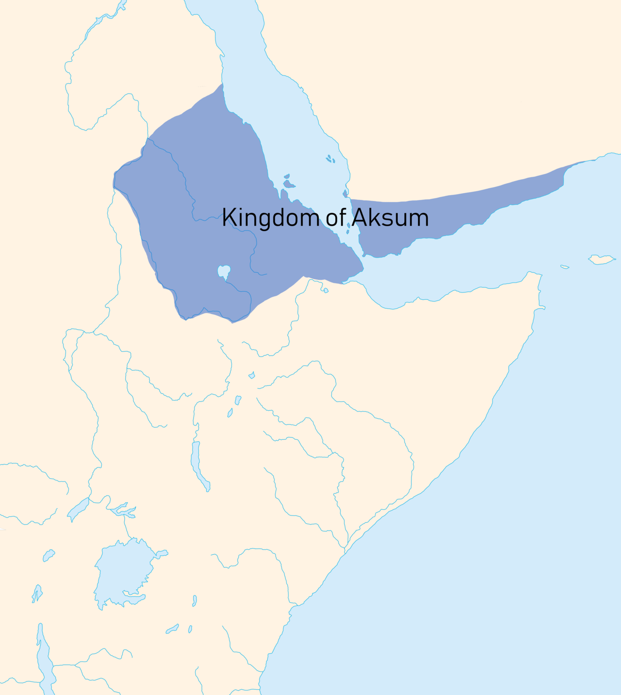

### Abrahah al-Ashram
#### ~500 - 570

### Summary

Abrahah was an [Aksumite](https://en.wikipedia.org/wiki/Kingdom_of_Aksum) Christian general in southern Arabia and ruler of Yemen as vicegerent of the Abyssinian king, Negus. He had a cathedral in San'a, Yemen, called al-Qullays (fig. 2). Abrahah's desire to replace the Ka'bah with his cathedral led to his vilification by the Arabs.

<figure>
  
  <figcaption>Fig.1 - The Kingdom of Abyssinia (Aksum).</figcaption>
</figure>

<figure>
  
  <figcaption>Fig.2 - Remnants of al-Qullays in San'a.</figcaption>
</figure>

### Overview of involved events and pages

event | page | summary
-|-|-
[Year of the Elephant](../events/0570_elephant.html) | 80-82 | Abrahah tries to attack the Ka'bah and fails miserably.
