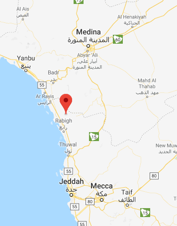

### Āminah bint Wahb
#### 549 - 577/8

She is the mother of [Rasulullah ﷺ](0570_Rasulullah) and the wife of [Abdullah](0546_Abdullah).

### Overview of involved events and pages

event | page | summary
-|-|-
[Birth and early life of Rasulullah ﷺ](../events/0570_Birth_to_prophethood) | 95-98 | Āminah witnessed many signs of the exalted future of Rasulullah ﷺ before he was born.\nWhen Rasulullah ﷺ was 6 (576 CE), she took him to Yathrib to visit her father and the grave of Abdullah. On the return to Makkah, she passed away at Abwa.

<figure>
  
  <figcaption>Fig.1 - Abwa, where Āminah passed away.</figcaption>
</figure>
