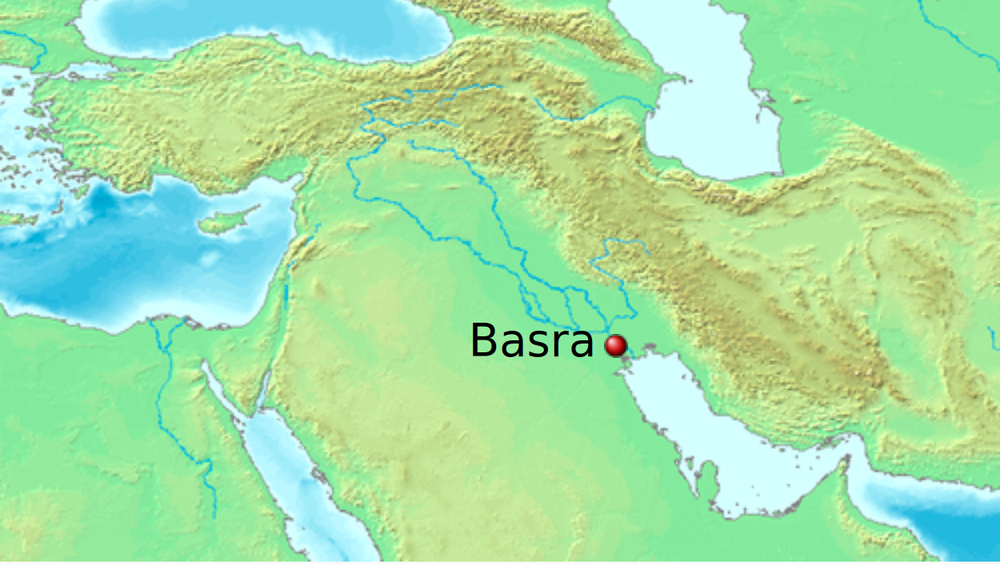

### Bāhīra
#### unknown - ~580

Bāhīra was a Christian monk and ascetic who lived near Basra, south of Shaam.

<figure>
  
  <figcaption>Fig.1 - Basra.</figcaption>
</figure>

### Overview of involved events and pages

event | page | summary
-|-|-
[Birth and early life of Rasulullah ﷺ](../events/0570_Birth_to_prophethood) | 98-99 | When Rasulullah ﷺ and Abū Tālib were traveling towards Syria, they encountered Bāhīra, who gave glad tidings for the future of Rasulullah ﷺ and advised Abū Tālib to take him home and hide him from the Jews, which Abū Tālib obliged.
