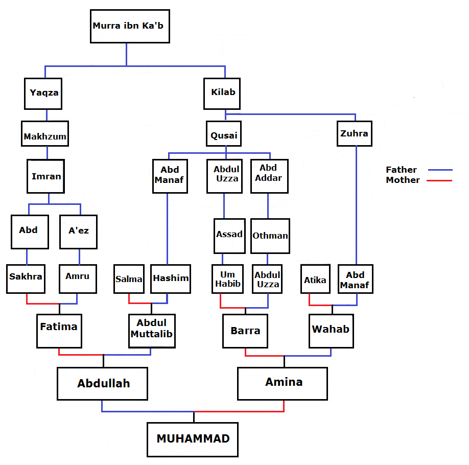

### Birth of Rasulullah ﷺ
#### 570 August 29 CE

### Summary

A summary of chapter 6: From birth to prophethood.  
This chapter deals with the circumstances around Rasulullah ﷺ's life before prophethood.

- [Rasulullah ﷺ's](../bio/0570_Rasulullah.html) grandfather, [Abd al-Muttalib](../bio/0497_Abd al_Muttalib.html), was a chief of the Quraysh.
- [Abdullah](../bio/0546_Abdullah.html), his son, was married to [Aminah](../bio/0549_Aminah.html).
- Their son was Muhammad ﷺ. He was born on the [Year of the Elephant]("0570_elephant.html")

<!-- ### People mentioned

[Abd al-Muttalib](../bio/0497_Abd al_Muttalib.html) — 95, 96, 98  
[Abdullah](../bio/0546_Abdullah.html) — 95, 98  
[Aminah](../bio/0549_Aminah.html) — 95-98  
[Thuwaybahؓ](../bio/Thuwaybah.html)   -->

### Lineage

