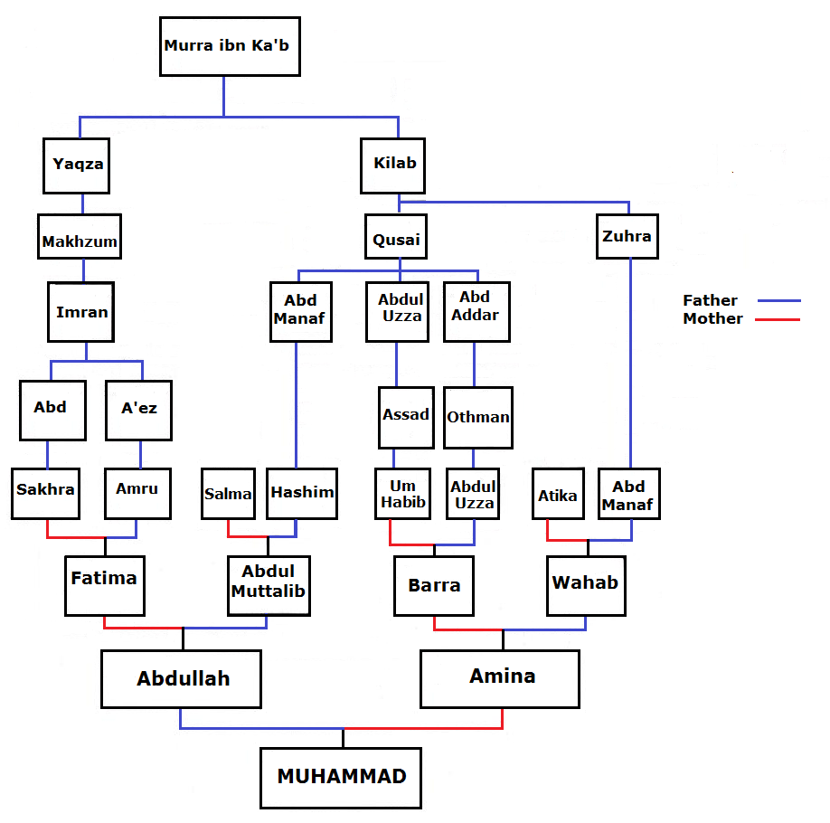

### Birth of Rasulullah ﷺ
#### 570 August 29 CE

### Summary

A summary of chapter 6: From birth to prophethood, since this chapter deals with the circumstances around Rasulullah ﷺ's life before prophethood.

### People mentioned

[Abd al-Muttalib](../bio/497_Abd al_Muttalib.html) | 95, 96, 98  
[Abdullah](../bio/546_Abdullah.html) | 95, 98  
[Aminah](../bio/549_Aminah.html) | 95-98  
[Thuwaybahؓ](../bio/Thuwaybah.html)  

### Lineage

