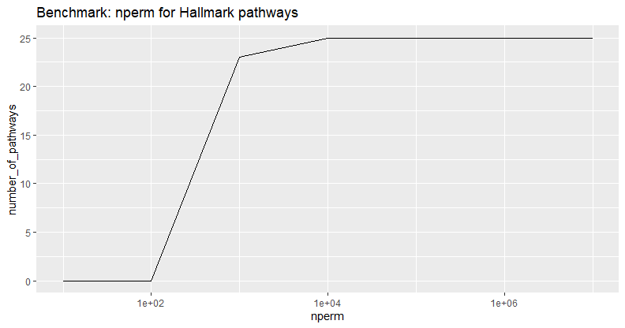
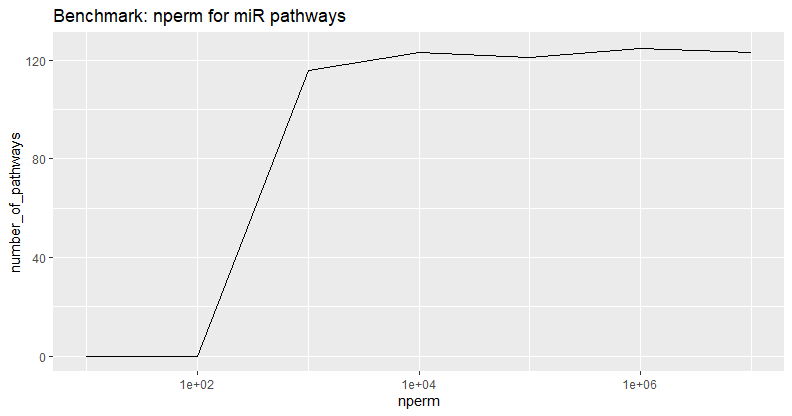
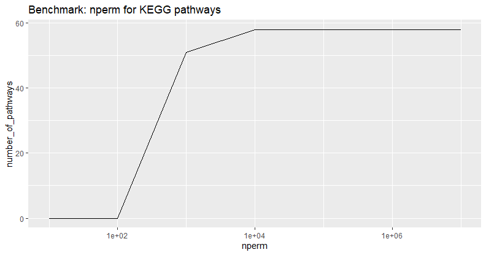
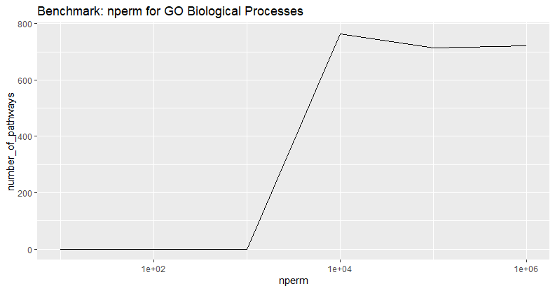
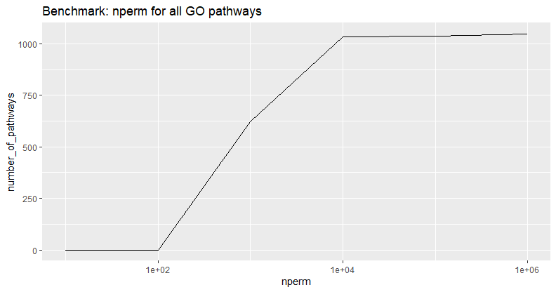
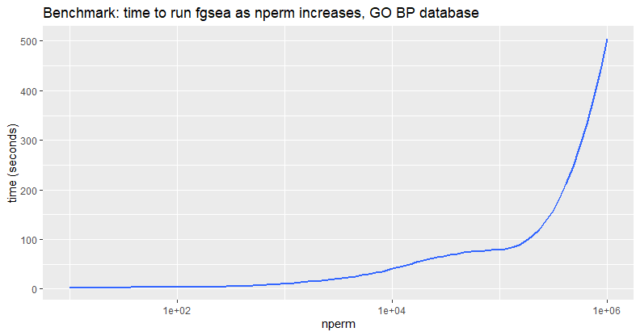
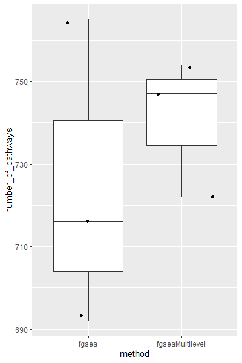

### `nperm` value fgsea testing
##### 12/5/2019<br>Sumeed Yoyo Manzoor<br>[The Chang Lab](https://changlab.uchicago.edu/) at the University of Chicago
###### Continued from []().<br>Continued on []().

<a href="https://changlab.uchicago.edu/" alt="The Chang Lab at the University of Chicago"></a>
<a href="https://github.com/Yoyomanzoor/RNA-SEQualizer/blob/master/code/R/fgsea%20benchmarks/Benchmark.md" alt="Github Repo"></a>
<a href="" alt="tag"></a>

#### `nperm` value

`nperm` in the method `fgsea()` was tested by increasing in orders of magnitude.\
zt2 (`time_1_2.feather`) WT genotype results were used for testing (`WT_res`).\
Readout measured in fgsea pathways resulting with `padj < 0.05` in the generic function:
```R
fgsea(pathways=gmtPathways(PATHWAYS), ranks, nperm=VARIABLE) %>%
  filter(padj < 0.05) %>%
  nrow()
# Where
# PATHWAYS = pathways database (http://software.broadinstitute.org/gsea/downloads.jsp)
# VARIABLE = {10,100,1000,10000,100000,1000000,10000000}
```











An asymptote seems to form at `nperm=10000`.\
The time to run `fgsea` with increasing `nperm` was tested:



Time increases exponentially O(k<sup>n</sup>), so the benefits to increasing `nperm` are practically limited. `nperm=10000` seems to be a sufficient value to detect all relevant pathways.

I also briefly checked `fgsea()` vs `fgseaMultiLevel()`.\
I used the GO BP database again. `nperm` was set to 10000.



There is no significant difference for number of pathways generated between running either command in this dataset. There is a significant amount of time saved using `fgsea()`, however, since `fgseaMultiLevel()` took 174.14 seconds, while `fgsea()` with `nperm=10000` took 25.85 seconds.

#### Script

See [`DESeq2.R`](../DESeq2.R) for complete script. \
`fgseaResTidy` was calculated for multiple `nperm` values then manually plotted in ggplot.

```R
ensembl <- useMart("ensembl")
ensemblMouse <- useDataset("mmusculus_gene_ensembl",mart=ensembl)
mouseProteinCodingGenes <- getBM(attributes=c("ensembl_gene_id","external_gene_name","description"), filters='biotype', values=c('protein_coding'), mart=ensemblMouse)

filePath = '../data/R/by_time/'
df <- read_feather(paste0(filePath, 'time_1_2.feather')) %>%
  .[rowSums(sapply(., '%in%', mouseProteinCodingGenes$ensembl_gene_id)) > 0,]

df <- set_rownames(df, df$Geneid) %>% dplyr::select(-Geneid)

gt_list <- rep(c(rep("WT",3), rep("KO",3)),2)
cond_list <- c(rep("SPF",6),rep("GF",6))
#create data frame to add all conditions
condition_list <- data.frame(row.names=colnames(df), Genotype=gt_list, Condition=cond_list)

condition_list$Genotype <- relevel(condition_list$Genotype, "WT")
condition_list$Condition <- relevel(condition_list$Condition, "SPF")

dds <- DESeq2::DESeqDataSetFromMatrix(countData=df,
                                           colData = condition_list,
                                           design = ~ Genotype + Condition + Genotype:Condition)

dds <- estimateSizeFactors(dds)

dds$Group <- factor(paste0(dds$Genotype, dds$Condition))
dds$Group <- relevel(dds$Group, "WTSPF")
design(dds) <- ~  Group

dds <- DESeq(dds)
#Compare SPF v GF in WT
WT_res <- results(dds,contrast=c("Group", "WTSPF", "WTGF"), tidy = TRUE)
#Compare SPF v GF in KO
KO_res <- results(dds, contrast=c("Group", "KOSPF", "KOGF"), tidy = TRUE)
#Compare WT v KO in SPF Conditions
SPF_res <- results(dds, contrast=c("Group", "WTSPF", "KOSPF"), tidy = TRUE)
#Compare WT v KO in GF Conditions
GF_res <- results(dds, contrast=c("Group", "WTGF", "KOGF"), tidy = TRUE)

res2 <- inner_join(WT_res, bm, by=c("row"="ensembl_gene_id")) %>%
  dplyr::select(hsapiens_homolog_associated_gene_name, stat) %>%
  na.omit() %>%
  distinct() %>%
  group_by(hsapiens_homolog_associated_gene_name) %>%
  summarize(stat=mean(stat))

ranks <- deframe(res2)
head(ranks, 20)

fgseaResTidy <- fgsea(pathways=gmtPathways("h.all.v7.0.symbols.gmt"), stats=ranks, nperm=100) %>%
  as_tibble() %>%
  filter(padj < 0.05) %>%
  arrange(desc(NES))

test <- data.frame(nperm = c(10,100,1000,10000,100000,1000000,10000000), number_of_pathways = c(0,0,23,25,25,25,25))
ggplot(test, aes(nperm, number_of_pathways)) +
  geom_line() +
  scale_x_log10() +
  ggtitle("Benchmark: nperm for Hallmark pathways")


fgseaResTidy <- fgsea(pathways=gmtPathways("c3.mir.v7.0.symbols.gmt"), ranks, nperm=10000000) %>%
  as_tibble() %>%
  filter(padj < 0.05) %>%
  arrange(padj)

test <- data.frame(nperm = c(10,100,1000,10000,100000,1000000,10000000), number_of_pathways = c(0,0,116,123,121,125,123))
ggplot(test, aes(nperm, number_of_pathways)) +
  geom_line() +
  scale_x_log10() +
  ggtitle("Benchmark: nperm for miR pathways")


fgseaResTidy <- fgsea(pathways=gmtPathways("c2.cp.kegg.v7.0.symbols.gmt"), ranks, nperm=10000000) %>%
  as_tibble() %>%
  filter(padj < 0.05) %>%
  arrange(padj)

test <- data.frame(nperm = c(10,100,1000,10000,100000,1000000,10000000), number_of_pathways = c(0,0,51,58,58,58,58))
ggplot(test, aes(nperm, number_of_pathways)) +
  geom_line() +
  scale_x_log10() +
  ggtitle("Benchmark: nperm for KEGG pathways")


benchmark <- function() {
  fgsea(pathways=gmtPathways("c5.bp.v7.0.symbols.gmt"), ranks, nperm=1000000) %>%
    as_tibble() %>%
    filter(padj < 0.05) %>%
    arrange(padj)
}
system.time(benchmark())
# Tested for nperm = 10,100,1000,10000,100000,1000000

test <- data.frame(nperm = c(10,100,1000,10000,100000,1000000), time = c(2.90,3.46,10.42,40.34,79.13,504.75))
ggplot(test, aes(nperm, time)) +
  # geom_line() +
  geom_smooth(formula= (y ~ exp(x))) +
  scale_x_log10() +
  ylab("time (seconds)") +
  ggtitle("Benchmark: time to run fgsea as nperm increases, GO BP database")

fgseaResTidy <- fgsea(pathways=gmtPathways("c5.bp.v7.0.symbols.gmt"), ranks, nperm=1000000) %>%
  as_tibble() %>%
  filter(padj < 0.05) %>%
  arrange(padj)

test <- data.frame(nperm = c(10,100,1000,10000,100000,1000000), number_of_pathways = c(0,0,0,765,713,722))
ggplot(test, aes(nperm, number_of_pathways)) +
  geom_line() +
  scale_x_log10() +
  ggtitle("Benchmark: nperm for GO Biological Processes")


fgseaResTidy <- fgsea(pathways=gmtPathways("c5.all.v7.0.symbols.gmt"), ranks, nperm=1000000) %>%
  as_tibble() %>%
  filter(padj < 0.05) %>%
  arrange(padj)

test <- data.frame(nperm = c(10,100,1000,10000,100000,1000000), number_of_pathways = c(0,0,620,1034,1036,1049))
ggplot(test, aes(nperm, number_of_pathways)) +
  geom_line() +
  scale_x_log10() +
  ggtitle("Benchmark: nperm for all GO pathways")

  benchmark <- function() {
    fgseaMultilevel(pathways=gmtPathways("c5.bp.v7.0.symbols.gmt"), ranks) %>%
      as_tibble() %>%
      filter(padj < 0.05) %>%
      arrange(padj)
  }
system.time(benchmark())

benchmark <- function() {
  fgsea(pathways=gmtPathways("c5.bp.v7.0.symbols.gmt"), ranks, nperm = 10000) %>%
    as_tibble() %>%
    filter(padj < 0.05) %>%
    arrange(padj)
}
system.time(benchmark())

fgseaMultilevel(pathways=gmtPathways("c5.bp.v7.0.symbols.gmt"), ranks) %>%
  as_tibble() %>%
  filter(padj < 0.05) %>%
  arrange(padj) %>%
  nrow()

fgsea(pathways=gmtPathways("c5.bp.v7.0.symbols.gmt"), ranks, nperm = 10000) %>%
  as_tibble() %>%
  filter(padj < 0.05) %>%
  arrange(padj) %>%
  nrow()

# test <- data.frame(method = c("fgsea(), nperm = 10^4", "fgseaMultiLevel()"), number_of_pathways = c(765,754,))
test <- data.frame(method = c(rep("fgsea", 3), rep("fgseaMultilevel", 3)), number_of_pathways = c(765,692,716,754,722,747))
ggplot(test, aes(method, number_of_pathways)) +
  geom_boxplot() +
  ggtitle("fgsea() vs fgseaMultiLevel()") +
  annotate("text",x = 1.5,y = 775, label = "p = 0.534")
```
