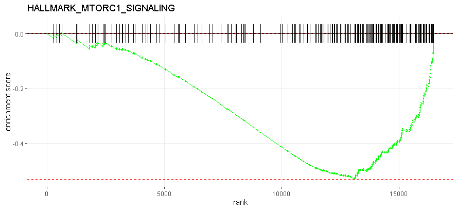
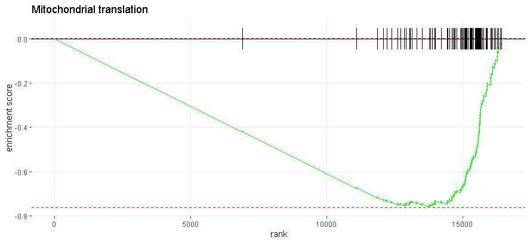

### RNA Seq notes: GF mice have increased mTORC1-associated and mitochondrial ribosomal protein expression
##### 1.30.2021 Sumeed Yoyo Manzoor [The Chang Lab](https://changlab.uchicago.edu/) at the University of Chicago
###### Continued on .

---

After an interesting set of thoughts about AMPK and mTORC1, I took a look at the data in RNA Seq to see if there was anything interesting.

`HALLMARK_MTORC1_SIGNALING` was significantly upregulated in GF mice.

Then, I saw that through reactome, mitochondrial translational proteins were way upregulated in GF mice:

|row                |   baseMean| log2FoldChange|     lfcSE|      stat|    pvalue|      padj| entrezgene_id|description                                                                                 |hsapiens_homolog_associated_gene_name |
|:------------------|----------:|--------------:|---------:|---------:|---------:|---------:|-------------:|:-------------------------------------------------------------------------------------------|:-------------------------------------|
|ENSMUSG00000068921 |  805.58512|     -0.3405104| 0.0458168| -7.431997| 0.0000000| 0.0000000|         65111|death associated protein 3 [Source:MGI Symbol;Acc:MGI:1929538]                              |DAP3                                  |
|ENSMUSG00000024683 |  775.96852|     -0.2701276| 0.0419320| -6.442042| 0.0000000| 0.0000000|         94063|mitochondrial ribosomal protein L16 [Source:MGI Symbol;Acc:MGI:2137219]                     |MRPL16                                |
|ENSMUSG00000033845 | 1320.11496|     -0.3458670| 0.0585665| -5.905539| 0.0000000| 0.0000002|         27395|mitochondrial ribosomal protein L15 [Source:MGI Symbol;Acc:MGI:1351639]                     |MRPL15                                |
|ENSMUSG00000062981 |  791.26455|     -0.3943153| 0.0715161| -5.513654| 0.0000000| 0.0000012|         67270|mitochondrial ribosomal protein L42 [Source:MGI Symbol;Acc:MGI:1333774]                     |MRPL42                                |
|ENSMUSG00000034932 |  373.49844|     -0.3913516| 0.0713233| -5.487010| 0.0000000| 0.0000014|         66047|mitochondrial ribosomal protein L54 [Source:MGI Symbol;Acc:MGI:1913297]                     |MRPL54                                |
|ENSMUSG00000018858 |  463.18512|     -0.3141921| 0.0607522| -5.171695| 0.0000002| 0.0000062|         68572|mitochondrial ribosomal protein L58 [Source:MGI Symbol;Acc:MGI:1915822]                     |MRPL58                                |
|ENSMUSG00000041632 |  525.13328|     -0.4053263| 0.0804153| -5.040415| 0.0000005| 0.0000112|        218506|mitochondrial ribosomal protein S27 [Source:MGI Symbol;Acc:MGI:1919064]                     |MRPS27                                |
|ENSMUSG00000026087 | 1237.54581|     -0.3497689| 0.0735431| -4.755974| 0.0000020| 0.0000379|        107734|mitochondrial ribosomal protein L30 [Source:MGI Symbol;Acc:MGI:1333820]                     |MRPL30                                |
|ENSMUSG00000026087 | 1237.54581|     -0.3497689| 0.0735431| -4.755974| 0.0000020| 0.0000379|        107734|mitochondrial ribosomal protein L30 [Source:MGI Symbol;Acc:MGI:1333820]                     |AC079447.1                            |
|ENSMUSG00000030335 |  712.53144|     -0.2577394| 0.0554903| -4.644764| 0.0000034| 0.0000595|         66493|mitochondrial ribosomal protein L51 [Source:MGI Symbol;Acc:MGI:1913743]                     |MRPL51                                |
|ENSMUSG00000040269 |  441.21159|     -0.3346329| 0.0723455| -4.625485| 0.0000037| 0.0000643|         66230|mitochondrial ribosomal protein S28 [Source:MGI Symbol;Acc:MGI:1913480]                     |MRPS28                                |
|ENSMUSG00000036860 |  320.94465|     -0.2787235| 0.0603587| -4.617787| 0.0000039| 0.0000659|         67212|mitochondrial ribosomal protein L55 [Source:MGI Symbol;Acc:MGI:1914462]                     |MRPL55                                |
|ENSMUSG00000000959 |  773.03166|     -0.2148627| 0.0508019| -4.229425| 0.0000234| 0.0002943|         69089|oxidase assembly 1-like [Source:MGI Symbol;Acc:MGI:1916339]                                 |OXA1L                                 |
|ENSMUSG00000046756 | 1258.66791|     -0.2121409| 0.0503507| -4.213263| 0.0000252| 0.0003122|         50529|mitchondrial ribosomal protein S7 [Source:MGI Symbol;Acc:MGI:1354367]                       |MRPS7                                 |
|ENSMUSG00000022370 |  807.99686|     -0.2622244| 0.0624949| -4.195931| 0.0000272| 0.0003302|         68537|mitochondrial ribosomal protein L13 [Source:MGI Symbol;Acc:MGI:2137218]                     |MRPL13                                |
|ENSMUSG00000010406 |  586.51272|     -0.4412912| 0.1058818| -4.167771| 0.0000308| 0.0003675|         68836|mitochondrial ribosomal protein L52 [Source:MGI Symbol;Acc:MGI:1916086]                     |MRPL52                                |
|ENSMUSG00000030706 |  276.62246|     -0.2796001| 0.0703876| -3.972290| 0.0000712| 0.0007299|         52443|mitochondrial ribosomal protein L48 [Source:MGI Symbol;Acc:MGI:1289321]                     |MRPL48                                |
|ENSMUSG00000028861 |  427.53504|     -0.2715397| 0.0688936| -3.941433| 0.0000810| 0.0008122|         66407|mitochondrial ribosomal protein S15 [Source:MGI Symbol;Acc:MGI:1913657]                     |MRPS15                                |
|ENSMUSG00000023939 |  627.60236|     -0.2187405| 0.0567274| -3.855993| 0.0001153| 0.0010785|         68463|mitochondrial ribosomal protein L14 [Source:MGI Symbol;Acc:MGI:1333864]                     |MRPL14                                |
|ENSMUSG00000045948 |  499.57482|     -0.2726497| 0.0717130| -3.801954| 0.0001436| 0.0012924|         24030|mitochondrial ribosomal protein S12 [Source:MGI Symbol;Acc:MGI:1346333]                     |MRPS12                                |
|ENSMUSG00000032563 |  469.20728|     -0.1567992| 0.0414103| -3.786474| 0.0001528| 0.0013560|         94062|mitochondrial ribosomal protein L3 [Source:MGI Symbol;Acc:MGI:2137204]                      |MRPL3                                 |
|ENSMUSG00000030879 |  827.50772|     -0.2037101| 0.0538140| -3.785445| 0.0001534| 0.0013592|         27397|mitochondrial ribosomal protein L17 [Source:MGI Symbol;Acc:MGI:1351608]                     |MRPL17                                |
|ENSMUSG00000019710 | 1041.39266|     -0.2091383| 0.0554300| -3.773014| 0.0001613| 0.0014124|         67707|mitochondrial ribosomal protein L24 [Source:MGI Symbol;Acc:MGI:1914957]                     |MRPL24                                |
|ENSMUSG00000007338 |  718.53017|     -0.1691026| 0.0451978| -3.741388| 0.0001830| 0.0015620|         18120|mitochondrial ribosomal protein L49 [Source:MGI Symbol;Acc:MGI:108180]                      |MRPL49                                |
|ENSMUSG00000001445 |  750.52061|     -0.1311787| 0.0352530| -3.721062| 0.0001984| 0.0016723|        107732|mitochondrial ribosomal protein L10 [Source:MGI Symbol;Acc:MGI:1333801]                     |MRPL10                                |
|ENSMUSG00000024902 |  583.52428|     -0.2377056| 0.0639428| -3.717475| 0.0002012| 0.0016924|         66419|mitochondrial ribosomal protein L11 [Source:MGI Symbol;Acc:MGI:2137215]                     |MRPL11                                |
|ENSMUSG00000031533 |  790.46302|     -0.1957277| 0.0527852| -3.708002| 0.0002089| 0.0017375|         57312|mitochondrial ribosomal protein S31 [Source:MGI Symbol;Acc:MGI:1913153]                     |MRPS31                                |
|ENSMUSG00000039640 | 1375.72901|     -0.2532291| 0.0686138| -3.690646| 0.0002237| 0.0018380|         56282|mitochondrial ribosomal protein L12 [Source:MGI Symbol;Acc:MGI:1926273]                     |MRPL12                                |
|ENSMUSG00000065990 | 1195.17007|     -0.2688790| 0.0728543| -3.690639| 0.0002237| 0.0018380|         66077|aurora kinase A interacting protein 1 [Source:MGI Symbol;Acc:MGI:1913327]                   |AURKAIP1                              |
|ENSMUSG00000054312 |  613.44871|     -0.2723064| 0.0745825| -3.651079| 0.0002611| 0.0020818|         66292|mitochondrial ribosomal protein S21 [Source:MGI Symbol;Acc:MGI:1913542]                     |MRPS21                                |
|ENSMUSG00000021731 |  386.85262|     -0.1889097| 0.0518858| -3.640871| 0.0002717| 0.0021410|         59054|mitochondrial ribosomal protein S30 [Source:MGI Symbol;Acc:MGI:1926237]                     |MRPS30                                |
|ENSMUSG00000063787 |  782.85434|     -0.2925774| 0.0805735| -3.631187| 0.0002821| 0.0022113|         66121|coiled-coil-helix-coiled-coil-helix domain containing 1 [Source:MGI Symbol;Acc:MGI:1913371] |CHCHD1                                |
|ENSMUSG00000034211 |  843.61574|     -0.1292439| 0.0357806| -3.612124| 0.0003037| 0.0023561|         66258|mitochondrial ribosomal protein S17 [Source:MGI Symbol;Acc:MGI:1913508]                     |MRPS17                                |
|ENSMUSG00000034211 |  843.61574|     -0.1292439| 0.0357806| -3.612124| 0.0003037| 0.0023561|         66258|mitochondrial ribosomal protein S17 [Source:MGI Symbol;Acc:MGI:1913508]                     |AC092647.5                            |
|ENSMUSG00000052962 |  591.61196|     -0.2353193| 0.0658646| -3.572774| 0.0003532| 0.0026560|         66223|mitochondrial ribosomal protein L35 [Source:MGI Symbol;Acc:MGI:1913473]                     |MRPL35                                |
|ENSMUSG00000040112 |  582.20169|     -0.1599039| 0.0449606| -3.556537| 0.0003758| 0.0027905|        232536|mitochondrial ribosomal protein S35 [Source:MGI Symbol;Acc:MGI:2385255]                     |MRPS35                                |
|ENSMUSG00000020514 |  282.37000|     -0.1831480| 0.0523014| -3.501782| 0.0004622| 0.0032932|        216767|mitochondrial ribosomal protein L22 [Source:MGI Symbol;Acc:MGI:1333794]                     |MRPL22                                |
|ENSMUSG00000014551 |  252.87294|     -0.2621262| 0.0752671| -3.482614| 0.0004965| 0.0034949|         64658|mitochondrial ribosomal protein S25 [Source:MGI Symbol;Acc:MGI:1928140]                     |MRPS25                                |
|ENSMUSG00000061474 |   48.17768|     -0.3183930| 0.0938599| -3.392214| 0.0006933| 0.0045825|         66128|mitochondrial ribosomal protein S36 [Source:MGI Symbol;Acc:MGI:1913378]                     |MRPS36                                |
|ENSMUSG00000026887 |  423.28195|     -0.2065901| 0.0619250| -3.336134| 0.0008495| 0.0053982|         67871|mitochondrial ribosome recycling factor [Source:MGI Symbol;Acc:MGI:1915121]                 |MRRF                                  |
|ENSMUSG00000027774 | 1636.88712|     -0.1872681| 0.0568261| -3.295461| 0.0009826| 0.0060562|         28030|G elongation factor, mitochondrial 1 [Source:MGI Symbol;Acc:MGI:107339]                     |GFM1                                  |
|ENSMUSG00000030612 |  426.04129|     -0.2392838| 0.0736924| -3.247064| 0.0011660| 0.0069548|         67308|mitochondrial ribosomal protein L46 [Source:MGI Symbol;Acc:MGI:1914558]                     |MRPL46                                |
|ENSMUSG00000026248 |  441.88446|     -0.1659477| 0.0516935| -3.210225| 0.0013263| 0.0076962|         69163|mitochondrial ribosomal protein L44 [Source:MGI Symbol;Acc:MGI:1916413]                     |MRPL44                                |
|ENSMUSG00000037740 |  300.37683|     -0.2378747| 0.0745963| -3.188827| 0.0014285| 0.0081409|         99045|mitochondrial ribosomal protein S26 [Source:MGI Symbol;Acc:MGI:1333830]                     |MRPS26                                |
|ENSMUSG00000024414 |  422.05878|     -0.2727640| 0.0873996| -3.120885| 0.0018031| 0.0097698|         94064|mitochondrial ribosomal protein L27 [Source:MGI Symbol;Acc:MGI:2137224]                     |MRPL27                                |
|ENSMUSG00000029918 |  107.48611|     -0.2938957| 0.0959675| -3.062451| 0.0021953| 0.0114436|         14548|mitochondrial ribosomal protein S33 [Source:MGI Symbol;Acc:MGI:1338046]                     |MRPS33                                |
|ENSMUSG00000021607 |  484.74652|     -0.2405100| 0.0791610| -3.038240| 0.0023796| 0.0122215|         94066|mitochondrial ribosomal protein L36 [Source:MGI Symbol;Acc:MGI:2137228]                     |MRPL36                                |
|ENSMUSG00000034880 |  427.41891|     -0.3659789| 0.1213094| -3.016905| 0.0025537| 0.0128812|         94065|mitochondrial ribosomal protein L34 [Source:MGI Symbol;Acc:MGI:2137227]                     |MRPL34                                |
|ENSMUSG00000028622 |  671.92584|     -0.1137289| 0.0377119| -3.015727| 0.0025636| 0.0129227|         56280|mitochondrial ribosomal protein L37 [Source:MGI Symbol;Acc:MGI:1926268]                     |MRPL37                                |
|ENSMUSG00000049960 |  529.68647|     -0.2109105| 0.0705642| -2.988918| 0.0027997| 0.0138788|         66242|mitochondrial ribosomal protein S16 [Source:MGI Symbol;Acc:MGI:1913492]                     |MRPS16                                |
|ENSMUSG00000058267 |  773.44182|     -0.1852964| 0.0625724| -2.961314| 0.0030633| 0.0148705|         64659|mitochondrial ribosomal protein S14 [Source:MGI Symbol;Acc:MGI:1928141]                     |MRPS14                                |
|ENSMUSG00000036850 |  338.32145|     -0.2242605| 0.0769926| -2.912755| 0.0035826| 0.0167608|        107733|mitochondrial ribosomal protein L41 [Source:MGI Symbol;Acc:MGI:1333816]                     |MRPL41                                |
|ENSMUSG00000022706 |  463.29684|     -0.1487220| 0.0519787| -2.861212| 0.0042202| 0.0189609|         18100|mitochondrial ribosomal protein L40 [Source:MGI Symbol;Acc:MGI:1332635]                     |MRPL40                                |
|ENSMUSG00000020477 |  620.13629|     -0.3005142| 0.1055717| -2.846541| 0.0044197| 0.0196517|         64660|mitochondrial ribosomal protein S24 [Source:MGI Symbol;Acc:MGI:1928142]                     |MRPS24                                |
|ENSMUSG00000044018 | 1430.26994|     -0.1578243| 0.0564998| -2.793357| 0.0052164| 0.0224475|         28028|mitochondrial ribosomal protein L50 [Source:MGI Symbol;Acc:MGI:107329]                      |MRPL50                                |
|ENSMUSG00000029066 |  979.15112|     -0.2425835| 0.0904859| -2.680899| 0.0073425| 0.0291113|         66448|mitochondrial ribosomal protein L20 [Source:MGI Symbol;Acc:MGI:2137221]                     |MRPL20                                |
|ENSMUSG00000023967 |  543.75332|     -0.1318669| 0.0504954| -2.611462| 0.0090156| 0.0341271|         68565|mitochondrial ribosomal protein S18A [Source:MGI Symbol;Acc:MGI:1915815]                    |MRPS18A                               |
|ENSMUSG00000028140 | 1062.82727|     -0.1510325| 0.0580461| -2.601939| 0.0092698| 0.0348866|         78523|mitochondrial ribosomal protein L9 [Source:MGI Symbol;Acc:MGI:2137211]                      |MRPL9                                 |
|ENSMUSG00000018882 |  517.30833|     -0.1348891| 0.0527324| -2.557990| 0.0105279| 0.0384623|         67036|mitochondrial ribosomal protein L45 [Source:MGI Symbol;Acc:MGI:1914286]                     |MRPL45                                |
|ENSMUSG00000038880 |  157.00708|     -0.5202062| 0.2064640| -2.519598| 0.0117489| 0.0417797|         79044|mitochondrial ribosomal protein S34 [Source:MGI Symbol;Acc:MGI:1930188]                     |MRPS34                                |
|ENSMUSG00000024829 |  359.81137|     -0.1754736| 0.0696780| -2.518350| 0.0117906| 0.0418684|        353242|mitochondrial ribosomal protein L21 [Source:MGI Symbol;Acc:MGI:2660674]                     |MRPL21                                |
|ENSMUSG00000019774 |  102.56770|     -0.1898686| 0.0781666| -2.429026| 0.0151395| 0.0508532|        108853|mitochondrial translational release factor 1-like [Source:MGI Symbol;Acc:MGI:1918830]       |MTRF1L                                |
|ENSMUSG00000030045 |  299.13276|     -0.1372850| 0.0579763| -2.367949| 0.0178870| 0.0578497|         56284|mitochondrial ribosomal protein L19 [Source:MGI Symbol;Acc:MGI:1926274]                     |MRPL19                                |
|ENSMUSG00000016833 |  190.79810|     -0.1976764| 0.0837402| -2.360591| 0.0182458| 0.0587438|         68735|mitochondrial ribosomal protein S18C [Source:MGI Symbol;Acc:MGI:1915985]                    |MRPS18C                               |
|ENSMUSG00000024181 |  763.18634|     -0.1179711| 0.0537956| -2.192951| 0.0283109| 0.0821879|         68611|mitochondrial ribosomal protein L28 [Source:MGI Symbol;Acc:MGI:1915861]                     |MRPL28                                |
|ENSMUSG00000027374 |  511.53747|     -0.0899783| 0.0438777| -2.050659| 0.0403002| 0.1069741|         77721|mitochondrial ribosomal protein S5 [Source:MGI Symbol;Acc:MGI:1924971]                      |MRPS5                                 |
|ENSMUSG00000023723 |  492.04505|     -0.1184716| 0.0578021| -2.049606| 0.0404029| 0.1071327|         64656|mitochondrial ribosomal protein S23 [Source:MGI Symbol;Acc:MGI:1928138]                     |MRPS23                                |
|ENSMUSG00000002767 |  680.62681|     -0.1113330| 0.0548112| -2.031211| 0.0422336| 0.1105964|         27398|mitochondrial ribosomal protein L2 [Source:MGI Symbol;Acc:MGI:1351622]                      |MRPL2                                 |
|ENSMUSG00000020775 |  887.09679|     -0.0978104| 0.0494264| -1.978911| 0.0478260| 0.1212332|         60441|mitochondrial ribosomal protein L38 [Source:MGI Symbol;Acc:MGI:1926269]                     |MRPL38                                |
|ENSMUSG00000024436 |  394.16934|     -0.1071936| 0.0552895| -1.938767| 0.0525297| 0.1299220|         66973|mitochondrial ribosomal protein S18B [Source:MGI Symbol;Acc:MGI:1914223]                    |MRPS18B                               |
|ENSMUSG00000021967 |  348.57684|     -0.1899291| 0.0997494| -1.904062| 0.0569021| 0.1380235|         67840|mitochondrial ribosomal protein L57 [Source:MGI Symbol;Acc:MGI:1915090]                     |MRPL57                                |

